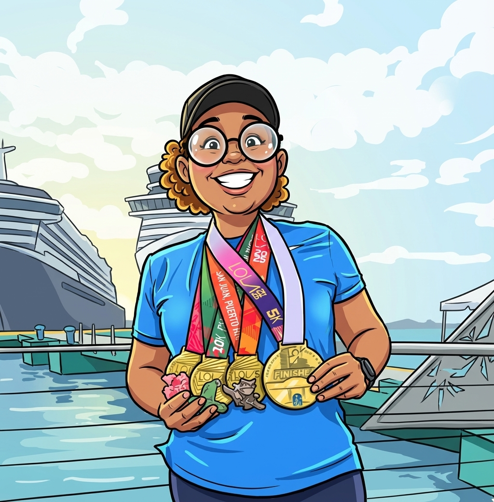
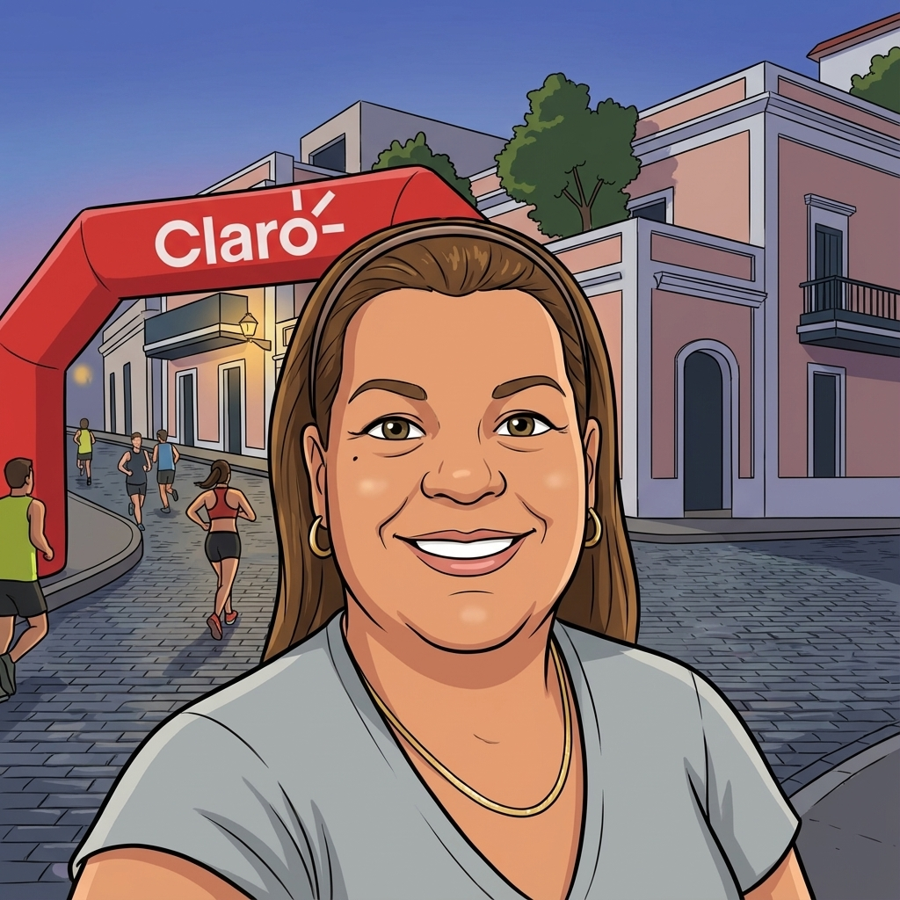

# El Crew 🌴

> *"Los mejores viajes no se miden en millas, sino en las risas compartidas y los momentos que se vuelven historias. Viajar con amigos es coleccionar recuerdos con las personas correctas."*

---

{ .crew-photo }

**Angie**

{ .crew-photo }

**Brian**

{ .crew-photo }

**Ernesto**

{ .crew-photo }

**Veronica**

{ .crew-photo }

**Heriberto**

{ .crew-photo }

**Mariana**

{ .crew-photo }

**Elena**

{ .crew-photo }

**Mary Rose**

{ .crew-photo }

**Juan Carlos**

