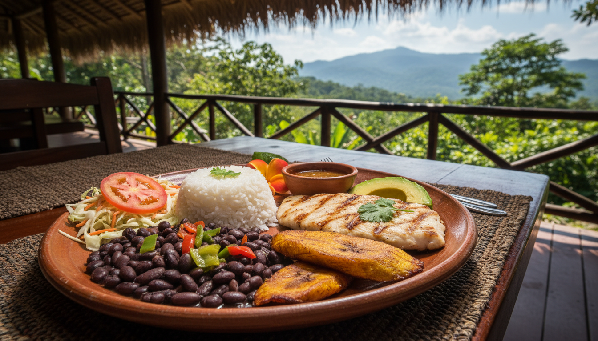

# Restaurantes en La Fortuna, Costa Rica

**Para:** Grupo de 10 adultos con 2 vehículos alquilados
**Contexto:** Día 3 (Martes 25 Noviembre 2025) - Actividades en La Fortuna

---

## Información Clave

La Fortuna ofrece excelente variedad de restaurantes para todos los presupuestos, desde sodas tradicionales muy económicas hasta fine dining. Para el grupo de 10 personas con vehículos propios, el **ESTACIONAMIENTO** es un factor importante.

**Puntos Clave:**

1. **ESTACIONAMIENTO:** Disponible en mayoría de lugares, especialmente fuera del centro
2. **PRECIOS:** Sodas $5-10 pp | Mid-range $10-25 pp | Premium $40-50 pp
3. **RESERVAS GRUPALES:** Recomendadas para Don Rufino, Kappa Sushi, Red Frog Coffee
4. **PROPINAS:** 10% servicio generalmente incluido. Total recomendado: 15-20%
5. **MEJOR PARKING:** Mercadito Arenal, Rio Lounge (cascada), Soda Viquez
6. **VENTAJA VEHÍCULOS:** Acceso a Rio Lounge (cascada), Red Frog Coffee, lugares fuera del centro

---

## Tabla Comparativa Rápida

| Restaurante | Categoría | Precio | Parking | Grupo 10 | Rating |
|-------------|-----------|--------|---------|----------|--------|
| **Don Rufino** | Premium fine dining | $40-50 | ✅ Afuera | ⚠️ Reservar días antes | ⭐⭐⭐⭐⭐ |
| **Rio Lounge** | Mid-almuerzo | $9-12 | ✅ Gratis (cascada) | ✅ Perfecto | ⭐⭐⭐⭐ |
| **Mercadito Arenal** | Mid-food court | $10-15 | ✅ Amplio | ✅ Perfecto (5 opciones) | ⭐⭐⭐⭐ |
| **Lava Lounge** | Mid-bar & grill | $15-25 | ✅ Cerca | ✅ Ambiente relajado | ⭐⭐⭐⭐ |
| **Kappa Sushi** | Mid-sushi | $15-20 | Público | ⚠️ Reservar | ⭐⭐⭐⭐ |
| **Red Frog Coffee** | Budget-desayuno | $8-12 | ✅ Propio | ✅ Avisar WhatsApp | ⭐⭐⭐⭐⭐ |
| **Soda Viquez** | Budget-típica | $8-10 | ✅ Detrás | ✅ Ideal | ⭐⭐⭐⭐⭐ |
| **Soda La Parada** | Budget-24h | $5-7 | Público | ✅ Siempre abierto | ⭐⭐⭐⭐ |
| **Soda La Hormiga** | Budget-barata | <$5 | ✅ Pequeño | ⚠️ Efectivo solo | ⭐⭐⭐⭐⭐ |
| **Restaurante Tiquicia** | Budget-casados | $8-12 | ✅ Probable | ✅ Auténtico | ⭐⭐⭐⭐⭐ |

---

## Explorar por Categoría

### [🌅 Opciones de Desayuno](restaurantes-la-fortuna/desayuno)
Desayuno temprano antes de actividades (6:30-7:00 AM)

**Incluye:** Soda La Parada (24h) | Red Frog Coffee (café premium)

**Mejor para:** Salida temprana a ATV/Cascada | Amantes del café

---

### [🍽️ Opciones de Almuerzo](restaurantes-la-fortuna/almuerzo)
Almuerzo durante/después de actividades

**Incluye:** Rio Lounge (dentro parque cascada) | Mercadito Arenal (food court)

**Mejor para:** Máxima conveniencia | Gustos diversos

---

### [🌙 Opciones de Cena](restaurantes-la-fortuna/cena)
Cena en centro La Fortuna (mid-range y premium)

**Incluye:** Don Rufino | Lava Lounge | Kappa Sushi | Nenes | Tierra Mia | Mercadito Arenal

**Mejor para:** Cena especial del grupo | Ambiente relajado | Variedad

---

### [💰 Sodas y Budget](restaurantes-la-fortuna/sodas-y-budget)
Opciones económicas y auténticas ($5-12 pp)

**Incluye:** Soda Viquez | Soda La Hormiga | Soda El Turnito | Restaurante Tiquicia | Soda La Parada

**Mejor para:** Presupuesto ajustado | Experiencia cultural auténtica

---

### [📱 Guía Práctica](restaurantes-la-fortuna/guia-practica)
Apps, mapas, parking, reservas, presupuestos, contactos, tips

**Incluye:** Mapa de restaurantes | Itinerarios sugeridos | Contactos clave | Consideraciones grupo 10

**Mejor para:** Planificación práctica | Información esencial antes del viaje

---

## Recomendaciones Top por Tipo

### Para Grupo de 10 con Vehículos (Parking Garantizado)

1. **Rio Lounge** - Dentro parque cascada | $9-12 pp | ✅ Parking gratis incluido
2. **Mercadito Arenal** - Food court variado | $10-15 pp | ✅ Parking amplio
3. **Soda Viquez** - Auténtica típica | $8-10 pp | ✅ Parking propio detrás

### Mejor Experiencia Premium

1. **Don Rufino** - Fine dining | $40-50 pp | ⚠️ RESERVAR: +506 2479-9997
2. **Red Frog Coffee** - Mejor café | $8-12 pp | WhatsApp: +506 8701-7987
3. **Lava Lounge** - Bar & grill | $15-25 pp | Música en vivo

### Máxima Conveniencia (Menos Manejo)

1. **Rio Lounge** - Dentro cascada | CERO manejo adicional durante visita
2. **Mercadito Arenal** - Food court | Todos eligen en un solo lugar
3. **Soda La Parada** - Centro | 24 horas, siempre abierto

### Mejor Presupuesto

1. **Soda La Hormiga** - Más barato | <$5 pp | ⚠️ Efectivo solo
2. **Soda La Parada** - 24 horas | $5-7 pp | Rápido y económico
3. **Soda Viquez** - Auténtico | $8-10 pp | Excelente relación calidad-precio

---

## Itinerario Sugerido Día 3

### OPCIÓN 1: Premium + Conveniencia ($69 pp)
- **6:30 AM** - Desayuno: Soda La Parada ($7 pp)
- **12:30 PM** - Almuerzo: Rio Lounge cascada ($12 pp)
- **7:30 PM** - Cena: Don Rufino ($50 pp) ⚠️ RESERVAR: +506 2479-9997

### OPCIÓN 2: Balance Calidad-Precio ($37 pp)
- **6:45 AM** - Desayuno: Red Frog Coffee ($10 pp) WhatsApp: +506 8701-7987
- **12:30 PM** - Almuerzo: Rio Lounge cascada ($12 pp)
- **7:30 PM** - Cena: Mercadito Arenal ($15 pp)

### OPCIÓN 3: Presupuesto Ajustado ($29 pp)
- **6:30 AM** - Desayuno: Soda La Parada ($7 pp)
- **12:30 PM** - Almuerzo: Rio Lounge cascada ($12 pp)
- **7:00 PM** - Cena: Soda Viquez ($10 pp)

---

## Presupuesto Estimado

### Por Persona (3 comidas)
- **Budget:** $20-30
- **Mid-range:** $35-50
- **Premium:** $60-80

### Grupo Completo (10 personas)
- **Budget:** $200-300
- **Mid-range:** $350-500
- **Premium:** $600-800

### Parking Total Día
- **$0-10** (mayoría incluido/gratis)

---

## Contactos Clave Rápidos

### Reservaciones Urgentes:
- **Don Rufino:** +506 2479-9997 (cena premium)
- **Red Frog Coffee:** +506 8701-7987 WhatsApp (desayuno grupo)
- **Kappa Sushi:** +506 2479-1639 (sushi)

### Consultas:
- **Rio Lounge (Cascada):** +506 2479-1777
- **Soda Viquez:** +506 2479-8772
- **Lava Lounge:** +506 7052-9251

### Walk-in (No necesitan reserva):
- **Soda La Parada:** +506 2479-9547 (24h)
- **Mercadito Arenal:** Ver Facebook (food court)
- **Sodas económicas:** Walk-in

---

## Consideraciones Importantes

### Parking para 2 Vehículos
**Mejor parking:**
- Mercadito Arenal (amplio)
- Rio Lounge (gratis en cascada)
- Soda Viquez (propio detrás)
- Don Rufino (justo afuera)
- Red Frog Coffee (propio)

### Métodos de Pago
**SOLO efectivo:**
- Soda La Hormiga
- Soda El Turnito

**Recomendación:** Retirar ₡15,000-20,000 colones pp (~$25-35 USD) para sodas y propinas

### Propinas
- 10% servicio generalmente incluido
- Adicional 5-10% por servicio excepcional
- Verificar cuenta antes de añadir propina

---

## Siguiente Paso

Ver las categorías arriba para información detallada de cada restaurante, o explorar la [Guía Práctica](restaurantes-la-fortuna/guia-practica) para mapas, itinerarios, y tips completos.

**¿Preguntas?** Toda la información está organizada por categorías para fácil navegación.

---
