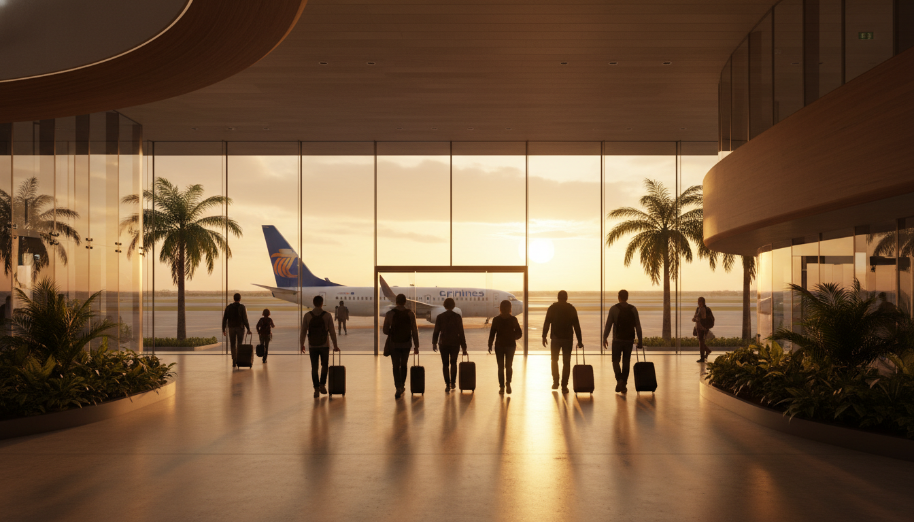

# ✈️ Información de Vuelos - Costa Rica Nov 2025

## 📅 Resumen
- **Fecha Salida:** Domingo 23 Noviembre 2025
- **Fecha Regreso:** Sábado 29 Noviembre 2025
- **Aerolínea:** Copa Airlines
- **Origen:** San Juan, Puerto Rico (SJU)
- **Destino:** San José, Costa Rica (SJO)
- **Conexión:** Panamá (PTY)

---

## 🛫 VUELO DE IDA - Domingo 23 Noviembre 2025

### Primer Tramo: San Juan → Panamá
- **Vuelo:** CM 451
- **Estado:** Scheduled ✅
- **Salida:** 5:27am - San Juan (SJU)
  - Terminal: INTL
  - Gate: Not assigned (asignado cerca de la fecha)
- **Llegada:** 7:30am - Panamá (PTY)
- **Duración:** 3h 31min
- **Operado por:** Copa Airlines

### ⏱️ Escala en Panamá
- **Duración:** 10h 58min
- **Terminal:** PTY
- **Nota:** Escala larga - considerar lounge o tour de ciudad

### Segundo Tramo: Panamá → San José
- **Vuelo:** CM 460
- **Estado:** Scheduled ✅
- **Salida:** 6:28pm - Panamá (PTY)
  - Terminal: 2
  - Gate: Not assigned
- **Llegada:** 6:55pm - San José (SJO)
- **Duración:** 1h 27min
- **Operado por:** Copa Airlines

### ⏰ Tiempos Importantes - Ida
- **Salida de casa:** Aprox. 3:00am-3:30am (llegar 2h antes al aeropuerto)
- **Llegada a SJU:** 4:30am-5:00am (check-in y seguridad)
- **Llegada a San José:** 6:55pm (hora local Costa Rica)
- **Recogida de vehículos:** 7:00pm-7:30pm (en aeropuerto SJO)
- **Llegada a Hotel Aloft:** Aprox. 8:00pm-8:30pm (30 min drive desde SJO)

---

## 🛬 VUELO DE REGRESO - Sábado 29 Noviembre 2025

### Primer Tramo: San José → Panamá
- **Vuelo:** CM 392
- **Estado:** Scheduled ✅
- **Salida:** 8:10am - San José (SJO)
  - Terminal: INTL
  - Gate: Not assigned
- **Llegada:** 10:32am - Panamá (PTY)
- **Duración:** 1h 22min
- **Operado por:** Copa Airlines

### ⏱️ Escala en Panamá
- **Duración:** 1h 49min
- **Terminal:** PTY
- **Nota:** Escala corta pero suficiente

### Segundo Tramo: Panamá → San Juan
- **Vuelo:** CM 142
- **Estado:** Scheduled ✅
- **Salida:** 12:21pm - Panamá (PTY)
  - Terminal: 2
  - Gate: Not assigned
- **Llegada:** 4:11pm - San Juan (SJU)
- **Duración:** 2h 50min
- **Operado por:** Copa Airlines

### ⏰ Tiempos Importantes - Regreso
- **Salida de Casa Ayarcos (Airbnb):** 6:00am-6:15am
- **Devolución de vehículos en SJO:** 6:30am-6:45am
- **Check-in aeropuerto:** 7:00am-7:30am (1h antes del vuelo)
- **Llegada a San Juan:** 4:11pm (hora local Puerto Rico)
- **Llegada a casa:** Aprox. 5:00pm-6:00pm

---

## 📋 PREPARATIVOS DE VUELO

### Antes del Viaje (1-2 semanas antes)
- Hacer check-in online 24 horas antes del vuelo
- Confirmar asientos seleccionados
- Verificar restricciones de equipaje Copa Airlines
- Guardar boarding passes digitales o impresos
- Verificar estado de vuelos en la app de Copa

### Documentos Necesarios
- Pasaporte válido (mínimo 6 meses de vigencia)
- Boarding passes (digital o impreso)
- Confirmación Hotel Aloft (6488.384.259)
- Confirmaciones Airbnbs (Casa Mañana + Casa Ayarcos)
- Confirmación alquiler de vehículos
- Licencia de conducir (internacional si aplica)
- Seguro de viaje (si aplica)

### Equipaje - Copa Airlines
- **Carry-on:** 1 maleta de mano (10 kg / 22 lbs)
- **Personal item:** 1 item personal (cartera, mochila pequeña)
- **Checked bag:** Verificar si incluido en tarifa o costo adicional
- **Dimensiones carry-on:** 56cm x 36cm x 23cm (22" x 14" x 9")

### Durante la Escala en Panamá

#### Ida (10h 58min de escala)
- Opción 1: Lounge Copa Club (si hay acceso disponible)
- Opción 2: Tour rápido de ciudad de Panamá
- Opción 3: Explorar terminal, comer, descansar
- Aprovechar para cargar dispositivos electrónicos
- Considerar cambiar dinero a Colones costarricenses

#### Regreso (1h 49min de escala)
- Tiempo justo - ir directo al siguiente gate
- Confirmar gate del siguiente vuelo en las pantallas
- Tener boarding pass listo con anticipación

---

## 🕐 ZONAS HORARIAS

### Puerto Rico (AST - Atlantic Standard Time)
- No cambia por horario de verano
- UTC -4

### Costa Rica (CST - Central Standard Time)
- No cambia por horario de verano
- UTC -6
- **Diferencia con PR:** -2 horas (Costa Rica está 2h atrás)

### Panamá (EST - Eastern Standard Time)
- No cambia por horario de verano
- UTC -5
- **Diferencia con PR:** -1 hora

**IMPORTANTE:** Al llegar a Costa Rica a las 6:55pm, en Puerto Rico serán las 8:55pm.

---

## 💡 RECOMENDACIONES

### Para el Vuelo de Ida
1. **Madrugada del 23:** Dormir temprano el 22 de noviembre
2. **Ropa del avión:** Cómoda, capas (aviones con A/C frío)
3. **Entretenimiento:** Para escala larga en Panamá
4. **Snacks:** Para escala (aunque hay restaurantes en PTY)
5. **Almohada de viaje:** Para descansar en escala larga

### Para el Vuelo de Regreso
1. **Check-out Casa Ayarcos:** 6:00am MÁXIMO
2. **Devolver vehículos:** 6:30am-6:45am en aeropuerto SJO
3. **Llenar tanque gasolina:** Viernes 28 PM (noche anterior)
4. **Desayuno:** Ligero antes de salir (preparar noche anterior)
5. **Última revisión:** No olvidar nada en Airbnb, verificar vehículos vacíos

### Apps Útiles
- Copa Airlines app - Estado de vuelos, boarding passes
- FlightAware - Tracking de vuelos en tiempo real
- Google Maps offline - Mapas de San José descargados
- WhatsApp - Comunicación con familia/anfitrión Airbnb

---

## 📞 CONTACTOS IMPORTANTES

### Copa Airlines
- **Teléfono:** 1-800-FLY-COPA (1-800-359-2672)
- **WhatsApp:** +507 304-2672
- **Web:** copa.com
- **App móvil:** Disponible iOS/Android

### Aeropuertos
- **SJU (San Juan):** +1 787-289-7000
- **SJO (San José):** +506 2437-2626
- **PTY (Panamá):** +507 238-2700

---

## 🎯 NOTAS ADICIONALES

### Consideraciones Especiales
- Vuelo muy temprano el 23 (5:27am) - planear transporte nocturno o quedarse cerca del aeropuerto
- Escala larga en Panamá ida (10h) - puede ser útil para descansar/explorar
- Llegada nocturna a San José (6:55pm) - **recoger 2 vehículos en aeropuerto SJO**
- Primera noche: **Hotel Aloft San José** (30 min drive desde aeropuerto)
- Vuelo de regreso temprano (8:10am) - **devolver vehículos 6:30am-6:45am en SJO**

### Items para Carry-On (Maleta de Mano)
- Documentos importantes (pasaporte, boarding passes)
- Medicamentos
- Cambio de ropa (por si equipaje se pierde)
- Electrónicos (laptop, tablet, cargadores)
- Artículos de valor
- Snacks
- Botella de agua vacía (llenar después de seguridad)

---
